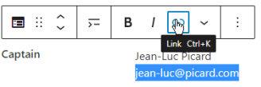
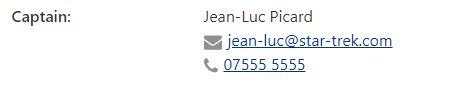

The `Attribute/value pair` block allows you to easily format items like a contact, or attributes like club colours etc.

You can transform attribute/value blocks to and from paragraphs, so if you have several attribute/values to add then the quickest way is to just enter them as paragraphs (include the colon, e.g. "Colours: Red", as everything before that is considered the attribute, and after it is the value), select the blocks, go to the toolbar and click the Paragraph icon (it'll be on the left) and select `Attribute/value pair` to transform to. If you have a multi-line value then make sure you use shift-Enter instead of Enter to keep all the lines within the same paragraph so that they will then be transformed to a single Attribute/value.

When you create the block it looks as follows:

Simply enter the values required. If you enter an email address or telephone number then you should make it a link so people can click it. To do that highlight the item, and hit the link icon in the toolbar:

For correctly formatted email addresses WordPress will automatically add `mailto:` to the start of the link to show it's an email. See [Telephone Number Links](editing.md#telephone-number-links) for details about linking to phone numbers.

Once you have filled out the fields the block should look as follows:

You will see that icons are added for email and telephone links.

You can also make the value be shown on the next line, using the option in the block toolbar.

