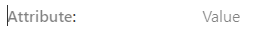

The `Attribute/value pair` block allows you to easily format items like a contact, or attributes like club colours etc.

You can transform attribute/value blocks to and from paragraphs, so if you have several attribute/values to add then the quickest way is to just enter them as paragraphs (include the colon, e.g. "Colours: Red", as everything before that is considered the attribute, and after it is the value), select the blocks, go to the toolbar and click the Paragraph icon (it'll be on the left) and select `Attribute/value pair` to transform to.

When you create the block it looks as follows:

Simply enter the values required. If you enter an email address or telephone number then you should make it a link so people can click it. To do that highlight the item, and hit the link icon in the toolbar:

For correctly formatted email addresses WordPress will automatically add `mailto:` to the start of the link to show it's an email. For telephone numbers you will need to add `tel:` to the beginning of the URL, and make sure there are no spaces in the number, so `tel:07123456789`, and not `tel: 07123 456789`. You can use the international number format and hyphens for separators, so `tel:+44-7123-456789` is valid. On mobile devices a `tel:` link will dial the number when a user clicks it, and desktop browsers may offer to make a call from their phone.

You should also nicely format the link text so it is easier to read. For mobile numbers that means grouping 5-6, 020 numbers 3-4-4, and if the number has an international dialing code then that should be separated and the first group size reduced by 1.

| Number | Formatted |
| ------ | --------- |
| `07123456789` | `07123 456789` |
| `+447123456789` | `+44 7123 456789` |
| `02012345679` | `020 1234 5679` |

Once you have filled out the fields the block should look as follows (note: on the live page the colon will be immediately after the attribute):

You will see that icons are added for email and telephone links.

You can also make the value be shown on the next line, using the option in the block toolbar.

