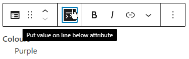

The `Attribute/value pair` block allows you to easily format attributes like club colours. For contacts use the [Contact Block](contact.md).

When you create the block it looks as follows:

Simply enter the values required. You can also make the value be shown on the next line, using the option in the block toolbar.

The block is also responsive so that when it's displayed on a device with a narrow page the value will be displayed on the next line to save space.

## Transforming To/From Other Blocks

You can transform Attribute/value blocks to and from Paragraphs and Contacts.

If you have several Attribute/values to add then the quickest way is to just enter them as Paragraphs, and include the colon, e.g. "Colours: Red", as everything before that is considered the attribute, and after it is the value. Select the blocks, go to the toolbar and click the Paragraph icon (it'll be on the left) and select `Attribute/value pair` to transform to. If you have a multi-line value then make sure you use shift-Enter instead of Enter to keep all the lines within the same paragraph so that they will then be transformed to a single Attribute/value.
