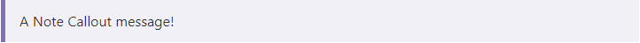

Callouts are used to draw attention to specific information. They are variations of the Group block so that you can add whatever blocks you want inside it. They can be added using the regular block inserter, or use the `/callout` shortcut.

| Variation | Colour | CSS Class |
|-----------|--------|-----------|
| Action | amber | callout-action |
| Information | blue | callout-info |
| Tip | green | callout-tip |
| Note | purple | callout-info |
| Warning | red | callout-warning |

Since Callouts are just Groups, once you have added it you can modify its style.

Each variation is created by setting our custom CSS classes on the Group, which you can access in the block's Additional CSS Classes (in Settings under Advanced). Every variation will have the `callout` class, and then each variation will have its own extra CSS class to set the colours as above. Therefore if want to change an Action Callout into a Note just change the second CSS class from `callout-action` to `callout-note`.

If you want custom colours you can also just set the CSS classes to `callout` with no secondary class, and set your own border, background, and text colour in the Group Settings.
