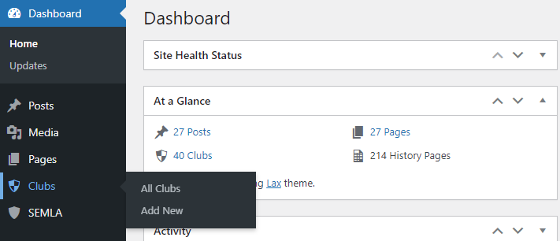

Clubs are added using their own post type, and can be found on the main WordPress Admin Dashboard.

They are edited in the same way as regular pages and posts, however the club's location should be added using a [Location Block](location.md), as that will correctly format the Google Map, make sure the club is placed correctly on the Clubs Map etc.

You should also use the [Attribute Value Block](attribute-value.md) to correctly format things like contacts, club colours etc.

The format for a Club page should be:

* Heading (h2) - "Location"
* [Location Block](location.md)
* Heading (h2) - "Club Information"
* Paragraph with links to fixtures & club website or Facebook page. Note: the text of website links should contain the text "website" or "Facebook", possibly proceeded by "Club ", as these will be what is displayed on the Clubs List page.
* Club info like colours, founded date, and club contacts - all using [Attribute Value Blocks](attribute-value.md)

And then for each team:

* Heading (h2) - "{team name} Team Information"
* Paragraph with a link to team fixtures
* Team contacts using [Attribute Value Blocks](attribute-value.md)

To create links highlight the text for the link, click the link icon, and add the URL.

You should check out the layout for other Clubs to see what is possible.
