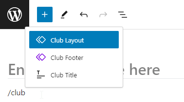
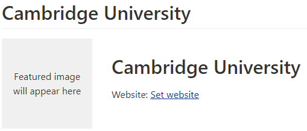
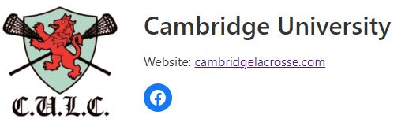

Clubs are added using their own post type, and can be found on the main WordPress Admin Dashboard menu. They are edited in the same way as regular pages and posts, though there are specific blocks that you should use.

**Before creating a new club**: if a club has a previous incarnation then it should still have a club page, it will just have a status of `Private` instead of `Published`. You can find all the Private clubs by going to the Clubs page in the dashboard, and at the top you can select `Private`, or select `All` to view everything. Just edit the club as usual, and don't forget to set the status to `Published` so that it appears on the front end.

Of course it follows from this, if you are deleting a club then don't actually delete it, just set the status to Private (you can also do this from the Clubs list using `Quick Edit`) unless that club will never be needed again.

The simplest option to populate a new club page is to **add the Club Layout pattern**, just start typing "/" and the pattern name where you see "Type / to choose a block" (see [Block Patterns](patterns.md) for more information, and alternative ways to add blocks). Note that you can modify this pattern for future use, or create additional patterns.

Alternatively you can duplicate an existing club by going to the Clubs page, and when you hover the mouse over a club you will see a `Duplicate` option which will create a new Club with the same content. Note this won't copy the featured image (club logo).

You might be tempted to modify an existing Private club instead of creating a new club, but you should never do this as you will lose the ability recreate that club, the historical revisions of the new club will include the old one, and if you have changed the page slug then WordPress will redirect any requests for the old club page to the new one.

You can easily delete any unwanted blocks by using the Document Overview (see below), and of course you can copy blocks from existing clubs.

If the Club has a logo then it should start with a **Club Title** block. This will replace the normal page title (the club name) on the front end as long as it contains a **Post Title** inner block, which it does by default (unfortunately we can't hide the standard title in the editor, so you will see the club name twice).

If you have entered the club name then a Club Title block with the club name above it will look like:

You need to set the Club's featured image to the logo. In the settings on the right select the Club tab rather than Block, and locate the **Featured Image** section. If you don't see the settings area, you may need to click on the settings icon in the top right corner to make it appear. Once you have uploaded or selected a featured image it will appear in the Club Title.

Inside the Club Title block you can also have a **Website** block, which is used to determine the club's website in other pages such as the Clubs List, and also a standard **Social Links** block for links to Facebook, Instagram etc.. Please make sure you use correct [link URLs](editing.md#link-url).

Once completed it should look something like:

The club's location should be added using a [Location Block](location.md), as that will format the Google Map, and make sure the club is placed on the Clubs Map etc.

You should use the [Contact Block](contact.md) for contacts, and the [Attribute Value Block](attribute-value.md) to format things like colours. You should take a look at both of those help pages as they detail easy ways to create these blocks by pasting or by transforming from other blocks.

If you know the Club's founded date then you should add it to the page under Club Information, unless the logo contains the founded date in which case it can be omitted, though you should make sure it's added to the [SEMLA Club Founded Dates Google Sheet](https://docs.google.com/spreadsheets/d/1_FFVi4FSQ5mW2Ory7X4gIRy-0JHlQEC3Zx6KJfQyusw/edit?usp=sharing)

Finally, at the bottom you should always add the **Club Footer** [synced pattern](patterns.md#synced-patterns).

You should check out the other Clubs to see what is possible.

## Clubs List

Information from the Club page is also used for the Clubs List [SEMLA Data block](semla-data.md), so you need to make sure you create the Club in the correct format.

Most, if not all, clubs should use the **Club Title** block. Its inner **Website** block is then used to populate the website link on the Clubs List. If there is no Website block then the Clubs List will use the first link on the page with the link text of "Website" or "Club Website" (case doesn't matter).

The other links are populated from the first **Social Icons** block on the page, usually the one in the Club Title block.
