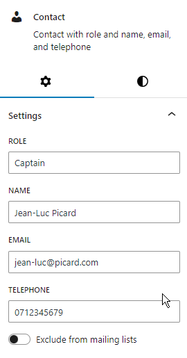

The `Contact` block allows you to easily format contacts, along with their email and telephone number.

When you create a new Contact it will display a form for you to complete. A completed form will look something like:


You will note the pencil icon in the toolbar, which allows you to change the edit mode of the Contact. This option will only be displayed once the block is valid (it has a role, and an email or telephone). When the block is invalid the form will always be displayed in the editor to prompt you to complete it.

When the Contact is valid the form will only be displayed when it is selected and in edit mode, otherwise it is displayed as it would be on the front end.


By default existing Contacts will be in view mode, so to edit them you can either change the block to edit mode, or you can also enter the values in the Settings side panel (though you may need to open it):



If you enter telephone numbers as just a string of numbers then the block will try to nicely format it for the user, so if you enter `07123456789` it will be stored as `07123 456789`. The formatting isn't very complicated and will only work for standard UK mobile numbers. If you want to format the phone number yourself then just enter a value with spaces and that value will be kept.

You can also make the contact details be shown on the next line to the role, using the option in the block toolbar.


The block is also responsive so that when it's displayed on a device with a narrow page the role will be displayed on one line, and the contact details on the next line.

## Pasting Values

The quickest way to create Contacts is to paste their values into the editor (Ctrl-V or Command-V, or Shift-Insert). For WordPress to detect that what you are pasting is a Contact it must be in the correct format as below, otherwise it will be pasted as a Paragraph.

`Role: <name> <email> <tel>`

The contact should be on a single line, with the role followed by a colon, then the name is optional, and there must be either an email or telephone number, or both.

Examples are:

```text
Captain: Jean-Luc Picard jean-luc@picard.com 07123456789  (1, works)
Captain: Jean-Luc Picard jean-luc@picard.com 07123 456789  (2, works)
Captain: Jean-Luc Picard (3, fails)
Captain: Jean-Luc Picard 07123456 (4, fails)
Captain: Jean-Luc Picard
        jean-luc@picard.com 07123456789 (5)
Captain Jean-Luc Picard jean-luc@picard.com 07123456789  (6, fails)
```

* 2 works as spaces in phone numbers are OK
* 3 fails because there is no email or telephone
* 4 fails as there's no email, and it's not a valid telephone number format
* 5 may work, but only if the editor thinks the 2 lines are 1 paragraph, so it depends on how you copied the contact. It's better to edit the contact into a single line before pasting.
* 6 fails as there is no colon

You can paste anywhere into the editor. If you paste into an existing block, like a Contact, then the new Contact will replace it. You can also paste where you see "Type / to choose a block".

To paste multiple contacts you must separate each by a blank line, otherwise they will be inserted as a large Paragraph.

## Transforming To/From Other Blocks

You can transform Contact blocks to and from Paragraphs and Attribute/values. When transforming to a Contact the format should be the same as pasting (though for attribute/values the attribute counts as the role, and you don't need a colon). Transforming will extract the email and telephone from appropriate links.

To transform select the blocks, go to the toolbar and click the block icon (it'll be on the left) and select the block to transform to. You might also find it easier to use the Document Overview.
