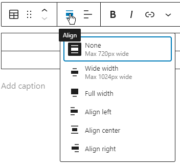

## Content Width

By default the content width is limited to 720px. This is because text is difficult to read if the lines are too wide. There is also a wide alignment of 1024px, and you can use this for blocks which support this (Image, Table, Media & Text, Column, .etc), however keep in mind the readability of the page.

Some blocks also support full width, but this should be used extremely sparingly.

## Post Author

You should be aware that posts (not pages or clubs) will display the author name and modified date. If you want this to display your actual name then you should create the post from a personal account (or see below to create posts from a different account). Note this doesn't mean having say a `semla_secretary` user with the name set to your name, as when someone else takes over that role that user's name will be changed, and all posts you authored will have the author name changed too! If you need a personal account then you should ask the Webmaster or another administrator to create one for you.

### Creating Posts As Different User

If you also have an user for your SEMLA role (e.g. Webmaster or President) and that user has the Editor or SEMLA Officer roles (and they most likely do) you can assign posts to a different author, either while editing it from the Post Settings, or you can change existing posts using Quick Edit or Bulk actions from the Posts list.
