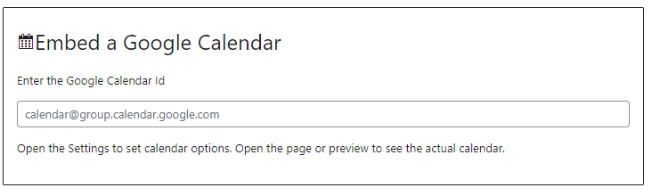
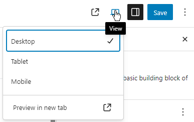
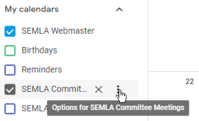
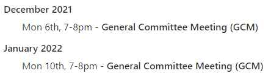
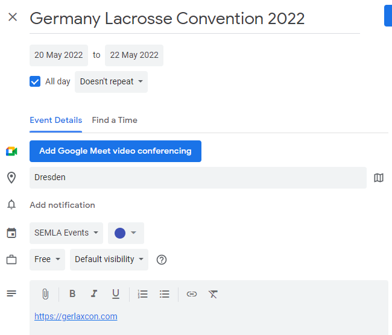
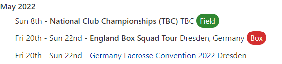
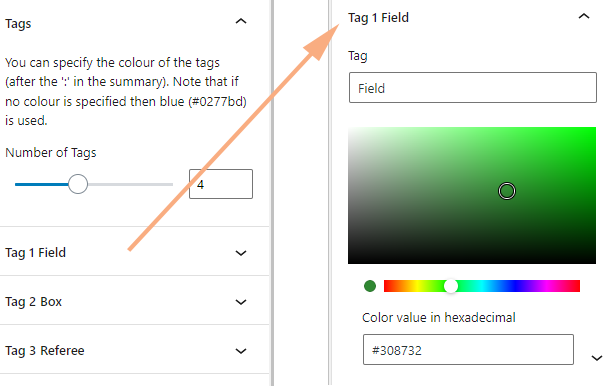

The Google Calendar block (don't pick the Calendar block) allows you display a Google calendar in a nice format.

Note that we don't show the live calendar in the editor, but once you have entered the Calendar Id you can simply open the preview to see what it will look like. Note that the preview works even if you haven't hit "Save" yet.

You will need to obtain the Calendar Id. If you don't own or subscribe to the calendar then you will need to get the id from the owner, but assuming you do then go to [Google Calendar](https://calendar.google.com/), and go to the options for that calendar.

Select "Settings and sharing", and if you scroll down you will find the `Calendar ID` under "Integrate calendar", which should look something like `urlmdm1n3p4cn421tb64jq3hig@group.calendar.google.com`

While you are there you should also check that the calendar is accessible to the public, otherwise the Google Calendar block will not be able to display it. Go to "Access permissions for events", and tick "Make available to public".

By default the calendar simply lists the events, split by month, with day name, day, start time, end date (if different) and time, and summary.

You can also use the enhanced mode, which additionally adds location, and extracts a URL from the description to use as a link (anything like `http://x.com`). It also adds adds coloured tags if you have ' : ' in the summary, so 'SBL Session 5 : Box' will have Box as the tag.

So, for example if you add the following event in Google Calendar

it will appear on the site as below ("Germany Lacrosse Convention 2022" is a link to `https://gerlaxcon.com`)

To set the enhanced mode you need to open the block settings (select the block, and if the settings are not open then click the settings icon in the top right, or `Ctrl+Shift+,`).

You can specify colours for the tags (default blue) under the Tags setting.

