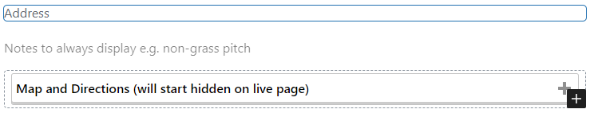

The Location block is used to display the location, map, and directions for a club. When you create a new block you will see:

Filling in the block should be straightforward, as there is placeholder text to show you what to enter. There is also extensive help in the block settings (you can open and close the settings panel using the gear icon in the top right, and select the block to see it's settings).

You should enter the club Address first, along with the postcode. If the postcode is with the London area then a link with directions via TFL will automatically be added.

You should then set the GPS coordinates of the ground. If you already know them you can add them in the block settings, otherwise you can use 'Set location on map' button:

That will take you to a dialog with a Google map, where you can drag a marker or double-click to set the exact position, or use the search box to search for a location.

**Note:** You should enter the address before opening the dialog, as the map will start at the address if there are no co-ordinates set.

Put important instructions that should always be displayed in the entry field above the map (e.g. non-grass pitch types and required footwear, non-standard start times), as anything below that will be hidden when the page is initially displayed.

Enter directions below the map. Since 99.9% of people have SatNav on their phones only add anything if the route is complicated, or things like the postcode taking people to the wrong place. And if possible add information about public transport.

You will note that there is a dotted line around content that will initially be hidden on the club's page.

The finished location will be appear on the site as below:

and open:

