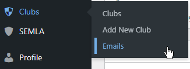

You can extract mailing lists for the clubs from `Clubs->Emails`.

On that page you can extract the email addresses from the Contacts on all Clubs pages in different formats, and optionally include the SEMLA Officers on the Contacts page. It will not include any Contacts on other posts or pages.

The page should be self explanatory, but you can use the `Display` button to see the mailing list it produces.

To exclude a Contact from the mailing list you can set `Exclude from mailing lists` on the [Contact](contact.md).
