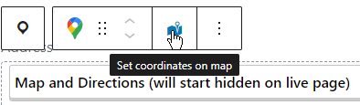

The Map block is used to display a Google map and directions, with both initially hidden when the page loads.

It is normally used inside a [Location block](location.md) so that a Club's address can be associated with its map coordinates, and if you select a standalone map it will display a warning to that effect when selected. You can [transform a Map block](https://gutenberghub.com/how-to-transform-a-block/) into a Location block if needed.

For the map to display properly you need to set its coordinates. If you already know them you can add them in the block settings (don't forget to click 'Update Coordinates' when you're done).

Otherwise you can use the 'Set coordinates on map' button from the block settings (above) or toolbar (below).

That will take you to a dialog with a Google map, where you can drag a marker or double-click to set the exact position, or use the search box to search for an address.

**Note:** If your map is within a Location block you should enter the address before opening the dialog, as the map will start at that address if there are no coordinates set.

Enter directions below the map. Since 99.9% of people have a SatNav on their phones only add anything if the route is complicated, or things like the postcode taking people to the wrong place. And if possible add information about public transport. Remember, the directions will start hidden, so if you have crucial information then put it above the map.

Once complete the block in the editor will look like:

And when live it will display as:

