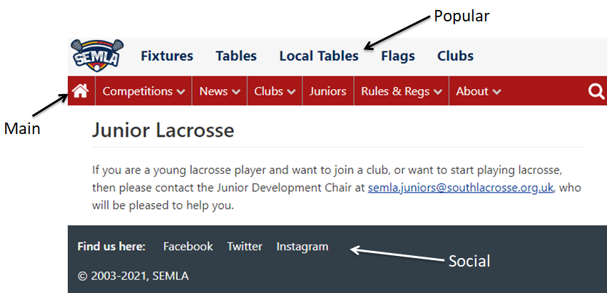
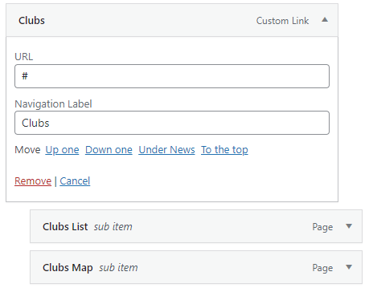
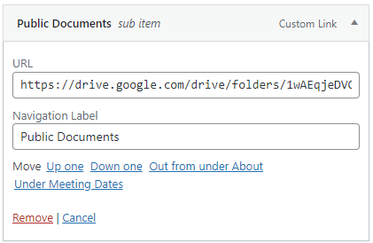

There are 3 menu areas available as shown below.

They are updated using the standard WordPress menu functions, so from the Dashboard go to Appearance->Menus.

In WordPress menus are hierarchical, however the Popular and Social menus will ignore that, and just output a list of menu items. This is because they are both meant to be a short list of links.

The Popular menu is only meant to display the main pages of the site, so people can quickly navigate without having to use the dropdown menu. The items should also be in the Main menu, as that is stickied so it will remain on the page even when a user scrolls down.

The Main menu is hierarchical, however the way the theme builds the menu means you have to abide by certain rules.

If you have a menu item with label "Home" then it will automatically be replace by the house icon.

If you want a top level menu item to be a dropdown, for example Clubs, the top level link must be a Custom link, with URL "#". You can then add the required pages under that menu item.

For links to external sites create a Custom link, e.g. the Public Documents link is:

One thing to be careful of, do not add too many items to the Popular or Main menus. The Social menu will automatically space all items over as many lines as needed, but the other 2 should be limited.

Before we go into why that is, it is worth briefly explaining the responsiveness of the site. If you resize your browser window you will notice that at a certain width the Main and Popular menus disappear, and they are replaced by the "hamburger" slide out menu. This is to allow mobile users with small screens to be able to use the site easily, without lines and lines of menus appearing at the top.

When displayed on larger screens the site looks best if the Popular and Main menus remain on 1 line each. If you add any menu items to Popular, or top level menu items to Main, you should check the menus remain on 1 line by opening the website in a browser, and shrinking the width until the mobile menu appears. If the menus split over 1 line you should redesign the menu, or alternatively you could change the theme's CSS to handle the change (though that is more complicated).
