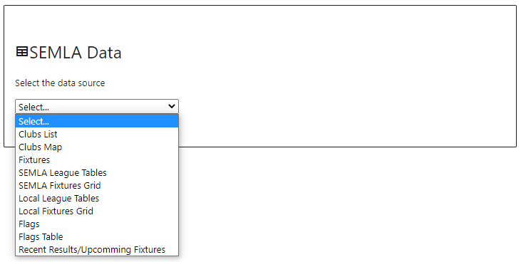
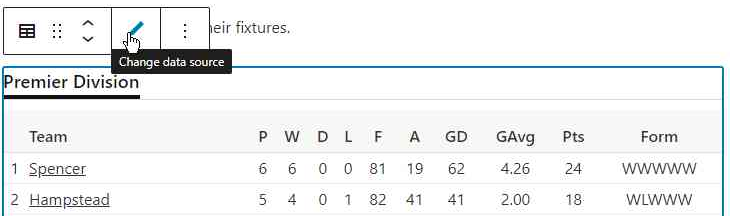

The SEMLA Data Block can be used to add League Tables, Fixtures etc. to any page. The normal usage is to create a page, e.g. League Tables, and add a SEMLA Data Block with the relevant data source, in this case "SEMLA League Tables".

Once you have selected the data source the block will display the content that would be displayed on the live site, so if you chose "SEMLA League Tables" you will see the league tables. To change the block's data source just click on the block, and click the "Change data source" icon.

