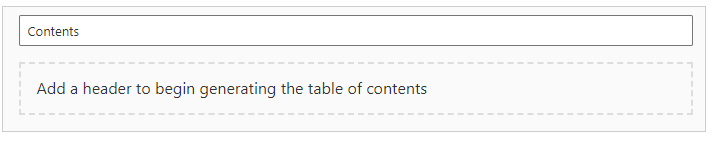
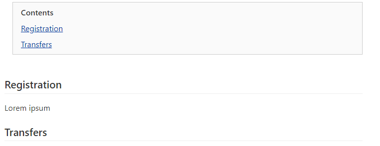
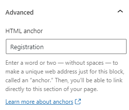

When you create a Table of contents it will display

You can change the Contents field to whatever you want for the table of contents heading, or leave it empty to default to "Contents". Then simply start adding headings, and they will automatically be added to the table of contents.

If headings are nested, e.g h2 then h3, then the h3s in the table of contents will also be indented.

Each item in the the table of contents will link to the appropriate heading using the HTML anchor for the heading. The anchor can be found in the Advanced block settings (to open up settings click the gear icon in the top right).

If any heading on the page doesn't have an anchor then one will be generated with st-{heading title} (st for sub-topic), so for Registration the link will be #st-Registration. The *st-* prefix is used so that the block knows it can change the anchor, so in the above example if you change Registration to "New Registrations" then the anchor will change to st-New-Registrations. You will usually want to specify your own anchors, in which case if you change the heading then you will also need to update the anchor.
